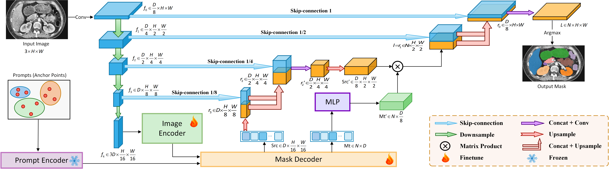

# U-SAM
<p align="left">
    
</p>


This repo holds the pytorch implementation of U-SAM:<br />

**CARE: A Large Scale CT Image Dataset and Clinical Applicable Benchmark Model for Rectal Cancer Segmentation** 
(https://arxiv.org/abs/2308.08283) 

### 1. Overview

We provide our implementation of U-SAM. The **CARE** dataset will be publicly available upon acceptance.The **dataloaders** of **CARE** and **WORD** are also available in **dataset**.

### 2. Pre-trained Weights

We utilized the SAM-ViT-B in our model, the pre-trained weights are supposed to be placed in the folder **weight**.

### 3. Citation
If this code is helpful for your study, please cite:

```
@article{zhang2023care,
  title={CARE: A Large Scale CT Image Dataset and Clinical Applicable Benchmark Model for Rectal Cancer Segmentation},
  author={Zhang, Hantao and Guo, Weidong and Qiu, Chenyang and Wan, Shouhong and Zou, Bingbing and Wang, Wanqin and Jin, Peiquan},
  journal={arXiv preprint arXiv:2308.08283},
  year={2023}
}
```