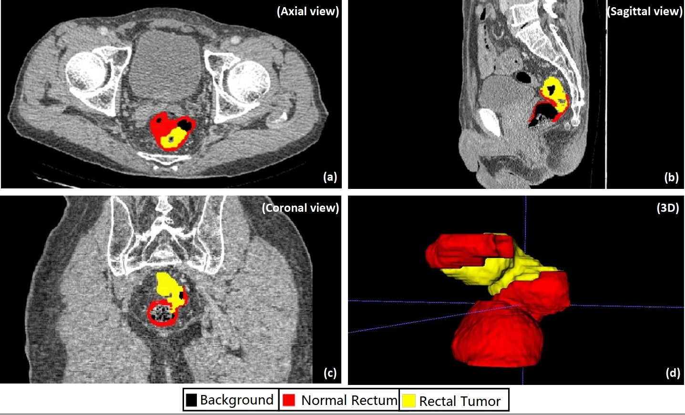

# U-SAM

**Tuning Vision Foundation Models for Rectal Cancer Segmentation from CT Scans**


## Model

- We provide our implementation of [U-SAM](https://github.com/kanydao/U-SAM/blob/main/u-sam.py). 
- The **dataloaders** of **CARE** and **WORD** are also available in [dataset](https://github.com/kanydao/U-SAM/tree/main/dataset).

## Datasets

The following pictures are demonstrations of **CARE**.




We conducted our experiments on **CARE** and **WORD**. Here we provide public access to these datasets. 

**CARE**: [[paper]](https://www.nature.com/articles/s43856-025-00953-0) [[dataset]](https://drive.google.com/file/d/1X_JTfD8Ch-IxmG5VHtKk_xGZT336Fl1Q/view?usp=drive_link)

**WORD**: [[paper]](https://arxiv.org/pdf/2111.02403.pdf) [[dataset]](https://github.com/HiLab-git/WORD)

## Get Started

### Main Requirements

- python==3.9.12

- torch==1.11.0
- torchvision==0.12.0
- numpy==1.21.5
- matplotlib==3.5.2

### Pre-trained Weights

We utilized the SAM-ViT-B in our model, the pre-trained weights are supposed to be placed in the folder [weight](https://github.com/kanydao/U-SAM/tree/main/weight). 

Pre-trained weights are available [here](https://github.com/facebookresearch/segment-anything), or you can directly download them via the following link.

- `vit_h`: [ViT-H SAM model.](https://dl.fbaipublicfiles.com/segment_anything/sam_vit_h_4b8939.pth)
- `vit_l`: [ViT-L SAM model.](https://dl.fbaipublicfiles.com/segment_anything/sam_vit_l_0b3195.pth)
- `vit_b`: [ViT-B SAM model.](https://dl.fbaipublicfiles.com/segment_anything/sam_vit_b_01ec64.pth)

## Training

Train 100 epochs on **CARE** with one single GPU: 

```bash
python u-sam.py --epochs 100 --batch_size 24 --dataset rectum
```

Train 100 epochs on **CARE** with multiple GPUs (via DDP, on 8 GPUs for example): 

```bash
CUDA_LAUNCH_BLOCKING=1;PYTHONUNBUFFERED=1;CUDA_VISIBLE_DEVICES=0,1,2,3,4,5,6,7 \
python -m torch.distributed.launch \
--master_port 29666 \
--nproc_per_node=8 \
--use_env u-sam.py \
--num_workers 4 \
--epochs 100 \
--batch_size 24 \
--dataset rectum
```

For convenience, you can use our default bash file:

```bash
bash train_sam.sh
```

## Evaluation

Evaluate on **CARE** with one single GPU:

```bash
python u-sam.py --dataset rectum --eval --resume chkpt/best.pth
```

The model checkpoint for evaluation should be specified via `--resume`.

## Feedback and Contact

For further questions, pls feel free to contact [Shouhong Wan](mailto:wansh@ustc.edu.cn).

## Acknowledgement

Our code is based on [Segment Anything](https://github.com/facebookresearch/segment-anything) and [SAMed](https://github.com/hitachinsk/SAMed). Thanks them for releasing their codes.

## Citation

If this code is helpful for your study, please cite:

```
@article{zhang2025tuning,
  title={Tuning vision foundation models for rectal cancer segmentation from CT scans},
  author={Zhang, Hantao and Guo, Weidong and Wan, Shouhong and Zou, Bingbing and Wang, Wanqin and Qiu, Chenyang and Liu, Kaige and Jin, Peiquan and Yang, Jiancheng},
  journal={Communications Medicine},
  volume={5},
  number={1},
  pages={256},
  year={2025},
  publisher={Nature Publishing Group UK London}
}
```
